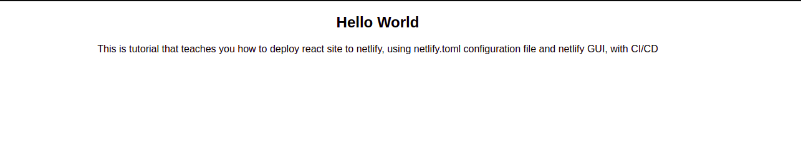

## Publish Simple React Site on Netlify using Netlify GUI, netlify.toml with CI/CD and Git.

## Site Deployed --> 🔗 https://game-of-thrones-blog.netlify.app/

## Steps

- Signup on <a href='https://www.netlify.com/'>Netlify</a>
- npm i -g yarn
- npx create-react-app app_name
- cd app_name
- create file (netlify.toml) on root
- add commands inside (as written in netlify.toml in my repo)
- commit and push app to github
- go to netlify
- click "new site from git"
- authorize
- select your repository
- click "deploy site"
- Open Website Url, and woohoo !! Your website is deployed
